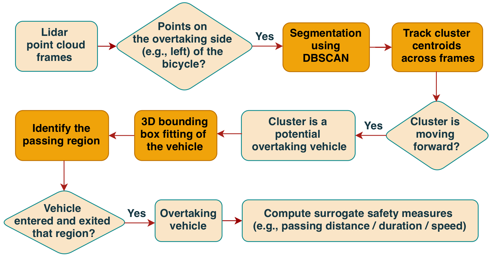
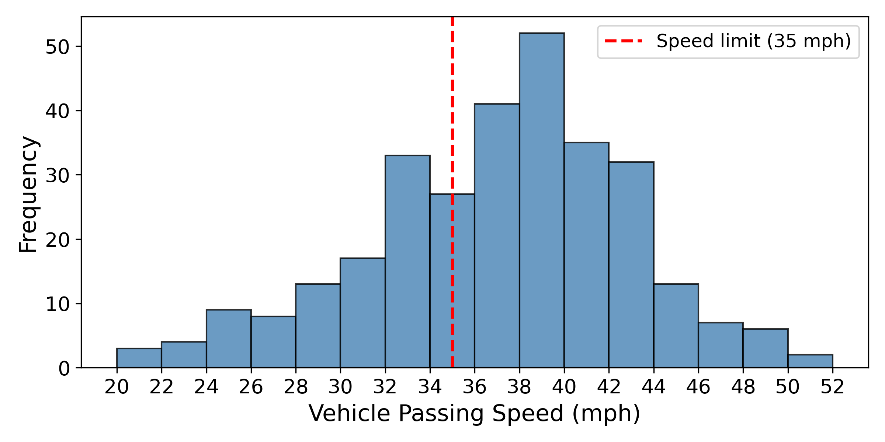
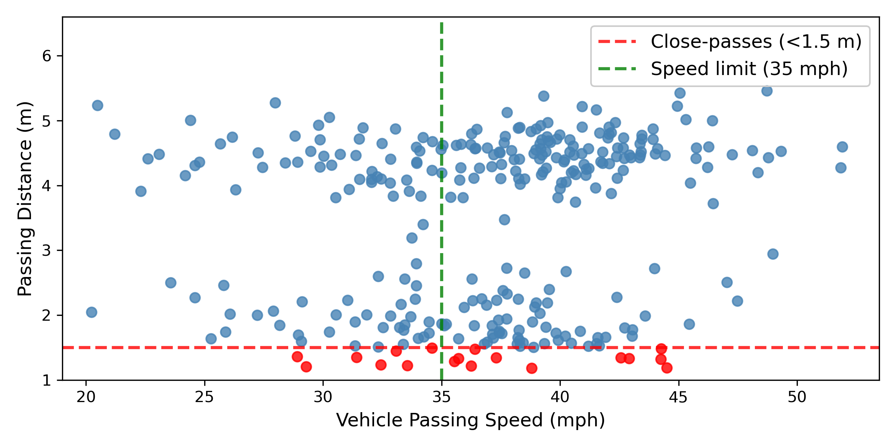

## Bicycling in the U.S.

- Bicycling is underutilized with **0.5%** of commuters riding a bicycle (vs. 69.2% commuters driving alone).[@uscb2024commuting]
- **1,166** bicyclists were killed and **49,989** injured in 2023.[@ncsa2025bicyclists]
- Drivers overtaking bicyclists is one of the most dangerous encounters with rear-end collisions accounting for 40% bicyclist fatalities.[@lab2014bicyclist]
- Previous studies on overtaking bicyclists typically used lower resolution sensors (e.g., ultrasonic sensors [@beck2019much] or 2D lidar [@dozza2016drivers]), offering limited insights.

## High resolution 3D lidar

- Lidar (Light Detection and Ranging) is a laser-based sensor that captures 3D representations of its surroundings.
- It enables detailed examination of road user behaviors and interactions (e.g., drivers, bicyclists) in real-world settings.

:::: {.columns}
::: {.column width="30%"}
{height="250"}
:::
::: {.column width="70%"}
{height="250"}
:::
::::

## Study objectives

- **Collecting and sharing bicycle riding data** in real-world settings using high resolution lidar and cameras.
- Develop algorithms to automatically 
  - **detect and track overtaking vehicles** based on the lidar point clouds captured on a bicycle,
  - **compute quantitative surrogate safety measures** for bicycling safety research.

## {data-menu-title="The lidar-equipped research bicycle"}

::: {style="text-align:center;font-size:50px;"}
{height="550"}
:::

## {data-menu-title="Point cloud demo"}

::: {style="text-align:center;font-size:50px;"}
[{height="550"}](https://fenggroup.org/pointcloud/examples/bike-2.html){preview-link="true"}
:::

## Preliminary data collection

:::: {.columns}
::: {.column width="58%"}
- Two trips in Ann Arbor, MI
- **4-lane** arterial road
  - **35 mph** speed limit
  - **painted bike lane** on each side
- Bicycle riding behavior
  - stay in the middle of bike lane
  - riding speed: 12-15 mph

- **306** vehicle overtaking events
:::
::: {.column width="42%"}

:::
::::

## {data-menu-title="Data collection demo video"}

::: {style="text-align: center;"}
<iframe
  width="880"
  height="550"
  src="https://www.youtube.com/embed/-ljcRm7nS6o"
  frameborder="0"
  allow="accelerometer; clipboard-write; encrypted-media; gyroscope; picture-in-picture"
  allowfullscreen>
</iframe>
:::

::: {style="text-align: center;"}
[Point cloud and camera data collection demo](https://www.youtube.com/watch?v=-ljcRm7nS6o)
:::

## {data-menu-title="Algorithm flow chart" }

::: {style="font-size:50px;"}

:::

## {data-menu-title="Segmented vehicles"}

::: {layout-nrow=2}
{height="220"}

{height="220"}

{height="220"}

{height="220"}
:::

::: {style="text-align:center;"}
Examples of segmented vehicles with 3D bounding boxes
:::

## Surrogate Safety Measures (1/3)
- **Passing distance**: the closest distance from the lidar to the car within the passing region
- **Passing duration**: the duration of time that a vehicle spends in the bicycle's passing region

::: {layout-ncol=2}
{height="220"}

{height="220"}
:::

## Surrogate Safety Measures (2/3)
- **Bicycle speed**: Based on frame-to-frame registration with
  - RANSAC (Random Sample Consensus [@ransac])
  - ICP (Iterative Closest Point [@icp])

{fig-align="center" height="340"}

## Surrogate Safety Measures (3/3)
- **Vehicle Speed**
  - **Relative vehicle speed** estimated using numerical differentiation of vehicle centroid locations across frames

  $$
  v(t)=\frac{x(t)-x(t-\Delta t)}{\Delta t}
  $$
  
$$
\text{vehicle speed} = \text{relative vehicle speed} + \text{bicycle speed}
$$

## Results

- 306 overtaking events from two trips
- 98 events had valid C3FT [@C3FT] readings (ground truth).
- Passing distance validation: MAE: 3.9 cm, MAPE: 2.5%

::: {layout-ncol=2}
{height="270"}

{height="270"}
:::

## {data-menu-title="Bicycle speed validation" }

 

::: {style="font-size:45px"}

:::

## {data-menu-title="Result figures"}

::: {layout-nrow="2"}

:::

## Discussions

- Passing duration reveals risk exposure over time
  - Longer overtakes typically due to traffic congestions or large vehicles (e.g., commercial trucks)
- The algorithms enable the detection of dangerous overtakes (i.e., *close pass at high speed*)
- Overtaking behavior depends on a combination of factors including roadway design, vehicle characteristics, and traffic conditions.

## Future work

- Continued data collection effort covering more roadway types and traffic conditions.
- Refining methods to improve vehicle detection accuracy under challenging conditions (e.g., tilted bicycle, roadway curvature, intersections)
- Developing and analyzing additional overtaking safety measures
  - e.g., vehicle lateral movements, the *timing* selection to initiate an overtaking

## Acknowledgements

This material is based upon work supported by the National Science Foundation under [Award Number 2142757](https://www.nsf.gov/awardsearch/show-award?AWD_ID=2142757).

::: {style="font-size:40px; color:gray"}
"CAREER: Improving Bicycling Safety by Developing a Research Framework for Studying Driver-Bicyclist Interactions"
:::

{fig-align="center" height="250"}

## References

::: {#refs}
:::

## Resources

- Slides URL & QR code
  - [fenggroup.org/trbam2026-lidar-bike](https://fenggroup.org/trbam2026-lidar-bike/)

  

- Public repositories
  - Data: [fenggroup.org/lidar-bike](https://fenggroup.org/lidar-bike/)
  - Code: [github.com/fenggroup/pointcloud-overtaking-vehicle-tracker](https://github.com/fenggroup/pointcloud-overtaking-vehicle-tracker)
- Contact: <fenggroup@umich.edu>
- Stay up to date: <https://fenggroup.org>
